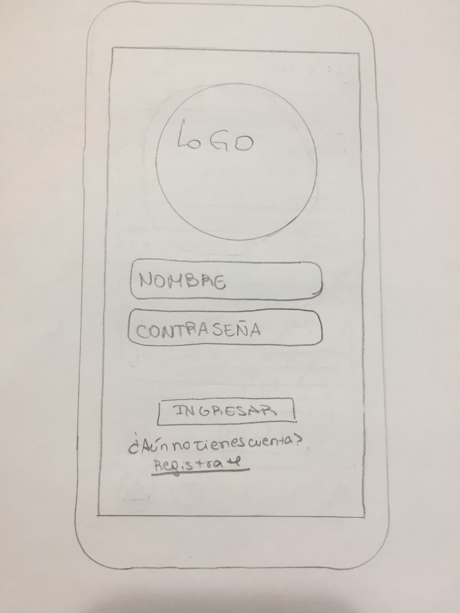
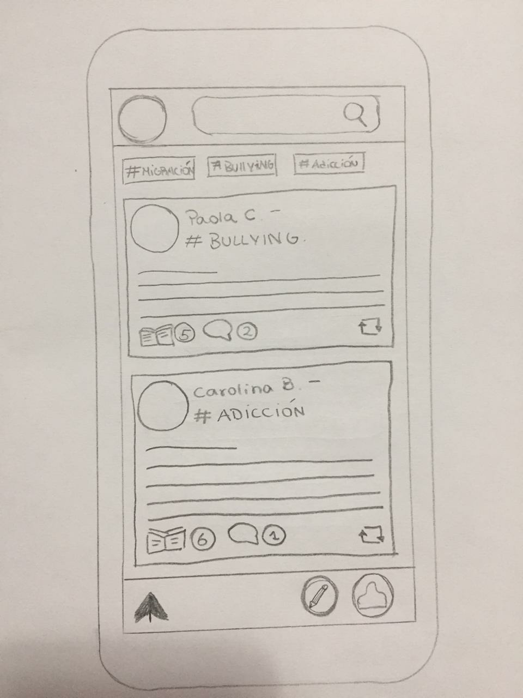
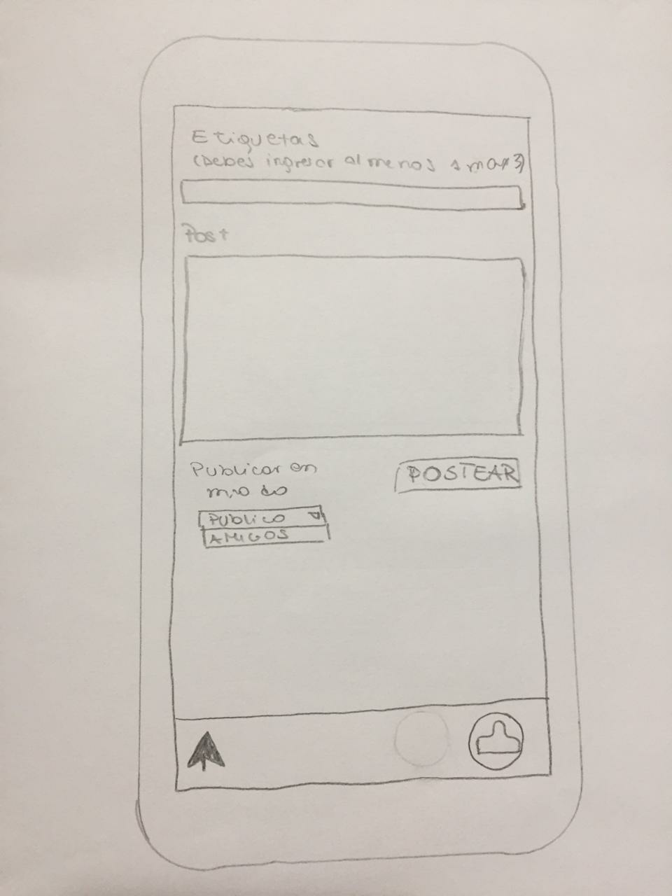
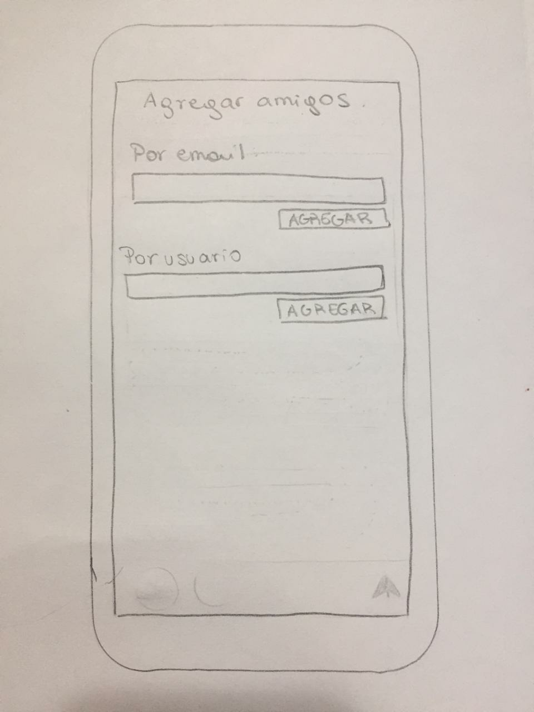

# TEACHERS' SQUAD

## **Introducción**

Es un aplicación que esta dirigida principalmente a Profesores de diferentes especialidades con la finalidad de generar la instancia dónde puedan aclarar dudas, orientarse en temas difíciles de abordar, buscar profesores de su misma disciplina con el objetivo de ver temas de carácter educativo. 

De esta manera les brindamos una facilidad al momento de organizar una actividad o dinámica para sus estudiantes y no saben como abordarla, basandose en la experiencia de otros profesionales. Por ejemplo: Si una Profesora de Orientación quiere abordar un tema sobre sexualidad y no sabe cómo, puede recurrir a esta aplicación preguntando directamente a los usuarios o buscando por "tag" sobre el tema y ver los contenidos que ya se han abordado, de esta manera además ahorran tiempo (que para ellos es muy escaso, dado a lo poco que disponen).

## **Ideación de Diseño**

Para definir el diseño de nuestra Red Social comenzamos a revisar la interfaz de usuario de distintas redes sociales como Facebook, Twitter e Instagram. 

### **Entrevista**  

Se realizó una encuesta a seis profesores de dististas disciplinas, les explicamos la aplicación que tenemos pensado hacer y les parece muy interesante porque ninguno conoce una aplicación que este dirigida principalmente a ellos.

### **Historia de usuario**

**Historia Nº 1**

Cómo: Profesora Jefe de un curso de enseñanza media.

Quiero: Un espacio donde poder compartir tips sobre temas difíciles de abordar en el aula.

Para: Compartir mi experiencia y conocer la de los demás en la planificación de las clases.

**Historia Nº 2**

Cómo: Profesora de orientación.

Quiero: Crear un post para pedir orientación a otros profesores sobre un tema.

Para: Abordar de mejor manera la clase con los alumnos.

**Historia Nº 3**

Cómo: Profesor de básica.

Quiero: Filtrar un tema específico.

Para: que aparezca las publicaciones sobre este tema que se han realizado en la aplicación.

**Historia Nº 4**

Cómo: Profesor.

Quiero: Agregar colegas de mi misma especialidad.

Para: ver sus publicaciones y/o poder contactarlos.

### **Definición de Terminado**

Historia Nº 1

* Iniciar sesión en la Red Social
* Hacer click en crear nuevo post
* Señalar el tag del tema que se abordará
* Seleccionar si su post será publico o privado
* Escribir el post
* Publicar post

Historia Nº 2

* Iniciar sesión en la Red Social
* Hacer click en crear nuevo post
* Señalar el tag del tema que necesito orientación
* Seleccionar, que el post sea público
* Escribir el post
* Publicar post

Historia Nº 3

* Iniciar sesión
* Escribir en el buscador de la página principal el tag sobre el tema
* Leer los post emitidos
* Escribir comentarios sobre esos post si tengo más dudas

Historia Nº 4

* Iniciar sesión
* Hacer click en el icono que aparece en la parte inferior de la aplicación
* Se despliega una columna, donde seleccionar la sección "Amigos"
* Luego escribir el nombre de la persona que esta buscando

### **Prototipo de baja de nuestra Red Social!**

El prototipo de esta página consta de 4 pantallas. La primera es donde el usuario debe iniciar sesión, que puede ser con una cuenta creada desde la aplicación, mediante su cuenta de Gmail o de Facebook, en caso que no este registrado y no quiere iniciar sesión desde las dos ultimas plataformas, hay un link que dice "registrate aquí" y se abre otra pantalla donde puede ingresar sus datos y crear su cuenta con clave.

Una vez registrado o iniciado sesión se abre otra pantalla que es la página principal de nuestra red social, donde puede ver las publicaciones de otros usuarios. En la parte superior hay un buscador donde damos la opción al usuario de buscar "tag"/ temas de su interés. Los post se pueden comentar y dar "likes" y el profesor que emitió su post puede eliminar y editarlo, lo mismo para los comentarios. En la parte inferior aparecen tres imágenes/símbolos: flecha hacia arriba (damos la opción de volver al inicio de las publicaciones rápidamente una vez que el usuario haya visto diversos post y ha bajado bastante, de esta manera se ahorra tiempo), lápiz (con este símbolo se puede crear un post) y una persona (al hacer "click" se despliega una columna donde puede ver su perfil, buscar amigos y cerrar sesión).

Al hacer "click" en el lápiz, aparece otra pantalla donde puede emitir el post, en la parte superior de esta sección hay un campo donde debe señalar el "tag"/tema de su post para que otros usuarios que buscan un tema especifico puedan encontrarlo. Luego debe seleccionar si su post será publico o privado (solo para amigos de su red). El tercer paso es emitir el post y al terminar debe hacer "click" en "publicar".

Si el usuario quiere buscar amigo debe hacer "click" en la parte inferior de la aplicación, luego en la opción buscar amigos y se abrirá otra pantalla donde podrá concretar la acción.

En esta imagen se muestra el inicio de nuestra aplicación donde el usuario debe iniciar sesión

 

Aquí se ve como sería nuestra pagina principal

En la siguiente imagen se ve como sería la sección para crear un nuevo post

En ésta ultima se ve como sería la sección para buscar amigos.

### **Planificación en Trello**

[Trello Teachers' Squad!](https://trello.com/b/O4sAh3Tq/teachers-squad)

